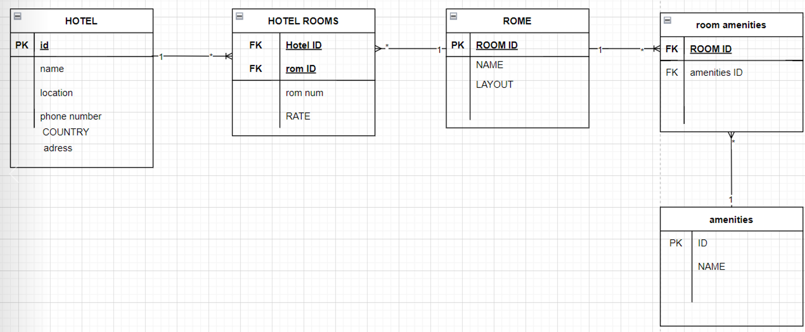

# Async-Inn

## api sarver roe hotels seres

## diagram explanation

1. in Hotel Table : we have a primary key for hotel id and its have some fields of name,location, contry, address, and phone number the Relationship with hotal room table is "one to many" you can join it using Hotel primary key.

2. in Hotel Room Table : we have hotle room id as foreign key ,hotle id as foreign keys and rome number andrate the Relationship with  room table is "many to one" .

3. in ROOM TABLE : we have have room id as primary key and useing in hotel room table as foreign key , and its  have name and layout as fields, the Relationship with  room aminities table is "one to many" .

4. in RoomAmenities Table : we have aminity id from aminity tableas forign keys and room id from room table as forign keys the Relationship with aminities table is "many to one" .

5. in Aminity Table : we have amenitiy id as a primary key and aminity name as a filed, the Relationship with aminities room table is "one to many"

### hotel location 

1.name
2.city
3.state
4.adress
5.phone number

### amenities

1.pole
2.pasket bool
3.mini bar
4.hot drinks

### each hotel has

1. lacation 
2. ID
3. number of roms

### each room has

1. ID
2. name
3.room number
4.price

### layout

1. bedroom
2.Electrical appliances
3.mini bar

